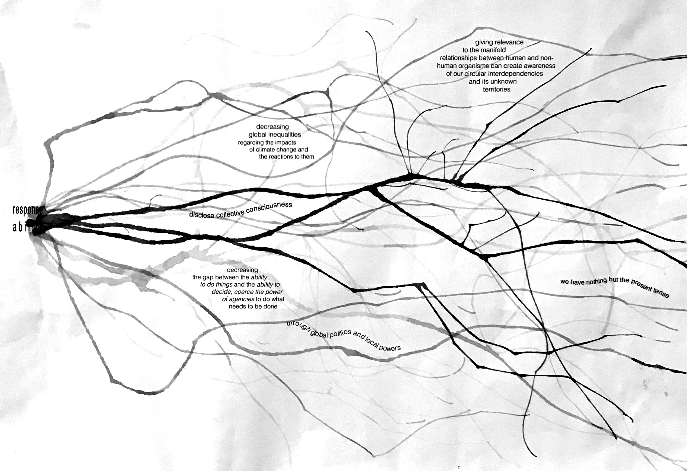

# my fight

my fight...

as a pacifist I am against any kind of violence.
so let me rephrase. I work against global inequalities and for an equal distribution of the impacts of climate change and expansive responses to them.

climate change affects differently in different areas of the world. I am a fan of differences; I don’t believe with homogeneity we will get anywhere. yet there is a clear distinction between difference and inequality. that the effects of climate change lead to threat and death of some human and non-human organisms, and to prosperity and luxury to others is not difference, but the result of an unequal distribution of resource access and consumption, knowledge acquisition and production, available adaptation and coping-mechanisms, -strategies, -tools, and, last but not least, the monopoly of telling stories that are listened to.

I am convinced that there are enough resources (human-brains that think, potent materials to be used responsibly, already developed, and tested mechanisms and strategies that will function as tools…) to prevent the effects of climate change leading to death of any human and non-human organisms. but instead of using the power that some have (because their stories are being listened to) to establish equally safe and thriving places everywhere, the effects of climate change are becoming more extreme.

why is that so?  I was educated as a sociologist and an artist; I don’t dare to give an answer that would suffice the complexity of human behavior.
but there are two ways I can approach the question:

firstly, through what I experience myself: when things are unknown, they seem to be more difficult to the extent that we often ignore them. what we do know becomes familiar and easy to handle yet what we have not experienced ourselves, seems vast and impossible to access.
similarly, we treat climate change. we easily ignore what we have not experienced or what is out of our immediate reach and cling to the ways and techniques we have experienced ourselves in our immediate environments. in a disconnected, individualist, capitalist world like the one I was raised and socialized in, this has fatal consequences. the knowledge of only two generations before us gets lost because we ourselves have not experienced its benefits; new technologies have freed us from thinking further than our own lives, the next year, the people living 15 km away, or even in the next street. we barely can emphasize with more than what we can touch. this happens on various scales, on the personal as well as on the political.

secondly, I can approach the question through the thoughts of previous thinkers. according to Zygmunt Bauman, power is the ability to have things done and politics is the ability to decide which things are to be done. his analyses of contemporaneity conclude that whereas earlier the abilities of power and politics were united in one place (nation-state government), nowadays, power has evaporated into global cyber-worlds while politics remained on local, nation-state levels. politics have failed to emigrate into the space of flows that Manuel Castells describes as the digital turn allowing distant synchronous, real-time interactions. power is today separated from politics and is in the hands of those who manage to navigate the systems of money and digital connectivity.
following this line of theory, the major source of contemporary fear is that no one is in control and those in power just keep on telling their stories.

to develop comprehensive and expansive responses to the impacts of global environmental changes, we must use and switch what Bauman has analyzed: establishing global politics and local power. that entails creating guidelines that open up unconditional spaces for a variety of stories to be told and heard.

my practice seeks for an equal distribution of the impacts of climate change and expansive responses to them by fueling the multiplicity of more-than-human narrations. I want to learn how to design balanced relationships that embody synergies, acknowledging that the interconnected whole is far more than the sum of its parts. this is all the same place, one world with all its differences and human and non-human organisms that are equally worth protecting and thriving.

in the end this has something to do with the notion of relevance. relevance as subjective and relative, determined by its space-time conditions. what do we learn to know and what do we not? what gets relevance to be known/ be experienced? giving relevance to the manifold relationships between human and non-human organisms can create awareness of our circular interdependencies and its unknown territories.
